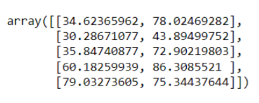
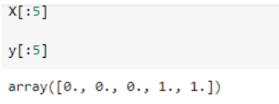
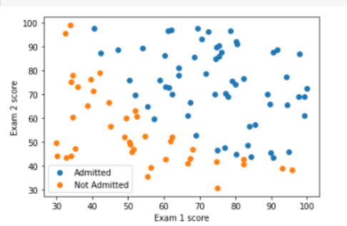
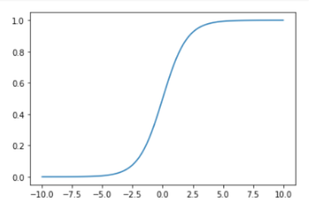
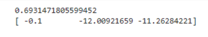
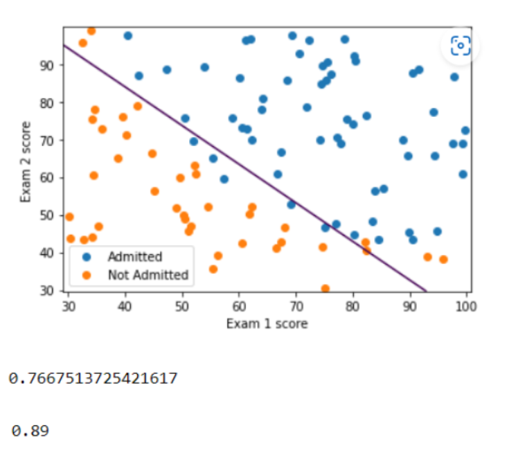

# Implementation-of-Logistic-Regression-Using-Gradient-Descent

## AIM:
To write a program to implement the the Logistic Regression Using Gradient Descent.

## Equipments Required:
1. Hardware – PCs
2. Anaconda – Python 3.7 Installation / Jupyter notebook

## Algorithm
1.Import the packages required.

2.Read the dataset.

3.Define X and Y array.

4.Define a function for costFunction,cost and gradient.

5.Define a function to plot the decision boundary and predict the Regression value

## Program:

Program to implement the the Logistic Regression Using Gradient Descent.

Developed by: M.Sowmya

RegisterNumber:  212221230107

```
import numpy as np
import matplotlib.pyplot as plt
from scipy import optimize

data=np.loadtxt("ex2data1.txt",delimiter=',')
X=data[:,[0,1]]
y=data[:,2]

X[:5]

y[:5]

plt.figure()
plt.scatter(X[y==1][:,0],X[y==1][:,1],label="Admitted")
plt.scatter(X[y==0][:,0],X[y==0][:,1],label="Not Admitted")
plt.xlabel("Exam 1 score")
plt.ylabel("Exam 2 score")
plt.legend()
plt.show()

def sigmoid(z):
    return 1/(1+np.exp(-z))

plt.plot()
X_plot=np.linspace(-10,10,100)
plt.plot(X_plot,sigmoid(X_plot))
plt.show()

def costFunction (theta,X,y):
    h=sigmoid(np.dot(X,theta))
    J=-(np.dot(y,np.log(h))+np.dot(1-y,np.log(1-h)))/X.shape[0]
    grad=np.dot(X.T,h-y)/X.shape[0]
    return J,grad

X_train=np.hstack((np.ones((X.shape[0],1)),X))
theta=np.array([0,0,0])
J,grad=costFunction(theta,X_train,y)
print(J)
print(grad)

def cost (theta,X,y):
    h=sigmoid(np.dot(X,theta))
    J=-(np.dot(y,np.log(h))+np.dot(1-y,np.log(1-h)))/X.shape[0]
    return J

def gradient (theta,X,y):
    h=sigmoid(np.dot(X,theta))
    grad=np.dot(X.T,h-y)/X.shape[0]
    return grad


```

## Output:









## Result:
Thus the program to implement the the Logistic Regression Using Gradient Descent is written and verified using python programming.

